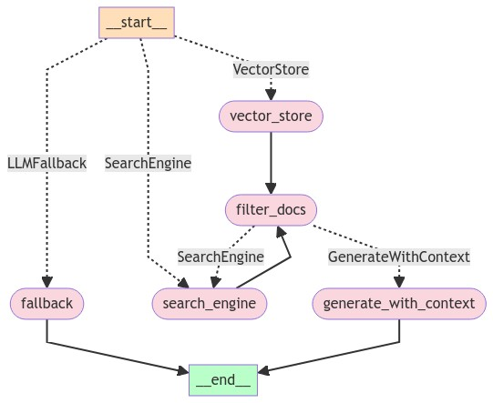

# NLP Expert Chatbot

This project is focused on creating an intelligent assistant that can respond to queries related to Natural Language Processing (NLP) by leveraging the content from the book *Speech and Language Processing* by Dan Jurafsky and James H. Martin. The assistant uses various components including web scraping, document embedding, vector stores, and language models to process and respond to user queries.

## Table of Contents

- [Installation](#installation)
- [Components](#components)
- [Workflow](#workflow)
- [Example Queries](#example-queries)
- [Acknowledgements](#acknowledgements)

## Installation

1. Clone the repository:

    ```bash
    git clone https://github.com/yourusername/nlp-jurafsky-assistant.git
    cd nlp-jurafsky-assistant
    ```

2. Create a virtual environment and activate it:

    ```bash
    python3 -m venv venv
    source venv/bin/activate
    ```

3. Install the required dependencies:

    ```bash
    pip install -r requirements.txt
    ```

4. Set up environment variables:

    ```bash
    cp .env.example .env
    # Edit .env to include your API keys and configurations
    ```

## Components

1. **Scraping**: Extract chapter links from the book's web page.
2. **Loading and Splitting**: Load PDF documents and split them into chunks for efficient processing.
3. **Embedding**: Embed document chunks using HuggingFace embeddings.
4. **Vector Store**: Store embeddings in a FAISS vector store for efficient retrieval.
5. **Query Handling**: Route user queries to the relevant component (VectorStore, SearchEngine, or Fallback).
6. **Response Generation**: Generate responses based on the context provided by the retrieved documents.

## Workflow

1. **User Query**: The user submits their query to the system. The initial input node is the decision-making node, `router_node`.

2. **Routing**: The `router_node` evaluates the query and determines the appropriate path to take. It has three potential edges leading to different nodes: `vector_store`, `search_engine`, and `fallback`. Based on the query, one of the following three scenarios occurs:

   - **Case 1: SearchEngine Route**:
     - The `search_engine` node is activated.
     - The output from `search_engine` is fed into the document identification node, `filter_docs`.
     - If `filter_docs` produces a non-empty list of documents, the `generate_with_context` node is called to generate the response, and the process ends.

   - **Case 2: VectorStore Route**:
     - The `vector_store` node retrieves relevant documents from the local database and passes them to `filter_docs`.
     - If `filter_docs` returns a non-empty list, the `generate_with_context` node is called to generate the response, and the process ends.
     - If `filter_docs` returns an empty list, the `search_engine` node is activated, and the output is processed as described in Case 1.

   - **Case 3: Fallback Route**:
     - The `fallback` node is directly activated, providing a fallback response.
     - The conversation process with the chatbot ends.



## Example Queries

- "What are N-grams in NLP?"
- "Explain the concept of transformers in NLP."
- "What is a binary search tree?"

## Acknowledgements

- *Speech and Language Processing* by Dan Jurafsky and James H. Martin for the content.
- HuggingFace for embedding models.
- FAISS by Meta for the vector store implementation.
- Tavily for the search engine integration.

## License

This project is licensed under the MIT License - see the [LICENSE](LICENSE) file for details.
